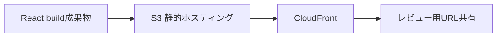
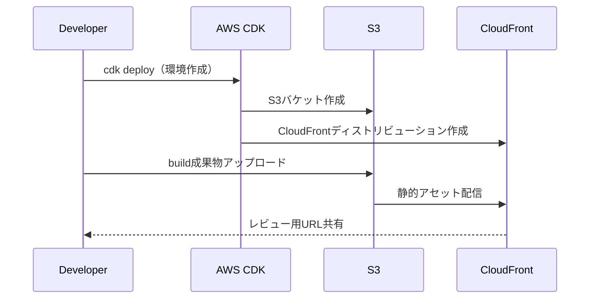

# frontend-preview-env 概要

新規開発（ゼロベース）フェーズで、フロントエンド（React）の画面を環境構築を待たずにレビュー可能にする“一時プレビュー環境”を標準化するための検証リポジトリです。

※ 本READMEでは「01開発」＝「新規開発（ゼロベース）」を指します。

## 課題（Before）
- 環境構築完了まで画面レビューができない
- レビューのタイミング・方法が属人化し、手戻りが発生
- 初期段階のUI/UX合意形成が遅れる

## 解決（目的）
- 画面レビューを前倒しして認識齟齬を削減
- ローカル依存を排し、再現性ある手順に標準化
- 使い捨ての一時環境で迅速に共有・破棄

## アプローチ（What / How）
AWS上に、Reactの静的ビルドをS3に配置し、CloudFrontで配信する一時プレビュー環境をIaC（CDK）で素早く構築・破棄する。

### 図解（構成）

標準フロー:
1. Reactを build
2. CDKでプレビュー環境を構築
3. build成果物を S3 へデプロイ
4. CloudFront の URL を共有（レビュー用）
5. レビュー完了後に環境を破棄

### 図解（プロセス）

## 更新（初回構築後）
一度環境（S3/CloudFront）を作成した後は、以降の更新は基本的に「Reactを再ビルドしてS3へアップロード」で完了します。CloudFrontにキャッシュが残る場合のみ、必要に応じて失効（Invalidation）を行います。

例（概念的な流れ）:
- 初回のみ: `cdk deploy` で環境作成
- 以降の更新: `npm run build` → S3へアップロード（CloudFrontが配信）
- 必要時: CloudFrontのキャッシュ失効（`/*` など）

## リポジトリの位置づけ
完成を目的としない検証用。チーム展開・改善議論のベースとする。

### 環境構築フォルダ
- [infra](infra): CDKによるS3+CloudFrontの一時プレビュー環境
- [scripts](scripts/README.md): Reactビルド成果物のS3同期とCloudFront失効
- [setup-guides](docs/setup-guides): WSL/Dockerのセットアップ手順

## 技術スタック（予定）
- React（静的build）
- AWS S3
- AWS CloudFront
- AWS CDK（Python）
- AWS SDK（boto3）