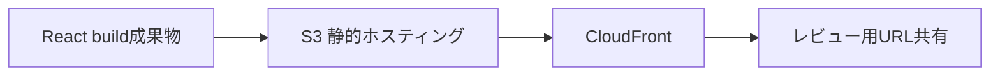
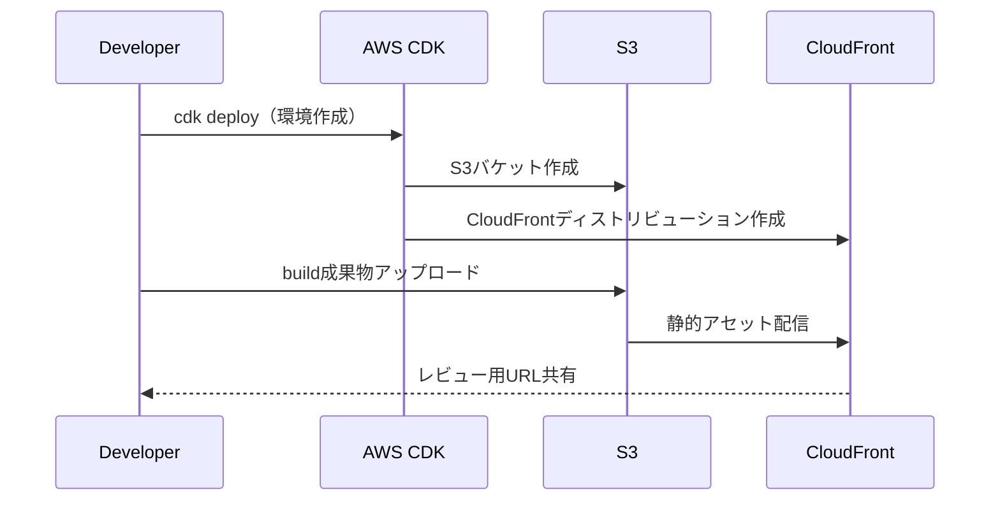

# frontend-preview-env 概要

新規開発（ゼロベース）フェーズで、フロントエンド（React）の画面を環境構築を待たずにレビュー可能にする“一時プレビュー環境”を標準化するための検証リポジトリです。

※ 本READMEでは「01開発」＝「新規開発（ゼロベース）」を指します。

## 課題（Before）
- 環境構築完了まで画面レビューができない
- レビューのタイミング・方法が属人化し、手戻りが発生
- 初期段階のUI/UX合意形成が遅れる

## 解決（目的）
- 画面レビューを前倒しして認識齟齬を削減
- ローカル依存を排し、再現性ある手順に標準化
- 使い捨ての一時環境で迅速に共有・破棄

## アプローチ（What / How）
AWS上に、Reactの静的ビルドをS3に配置し、CloudFrontで配信する一時プレビュー環境をIaC（CDK）で素早く構築・破棄する。

### 図解（構成）



標準フロー:
1. Reactを build
2. CDKでプレビュー環境を構築
3. build成果物を S3 へデプロイ
4. CloudFront の URL を共有（レビュー用）
5. レビュー完了後に環境を破棄

### 図解（プロセス）



## 更新（初回構築後）
一度環境（S3/CloudFront）を作成した後は、以降の更新は基本的に「Reactを再ビルドしてS3へアップロード」で完了します。CloudFrontにキャッシュが残る場合のみ、必要に応じて失効（Invalidation）を行います。

例（概念的な流れ）:
- 初回のみ: `cdk deploy` で環境作成
- 以降の更新: `npm run build` → S3へアップロード（CloudFrontが配信）
- 必要時: CloudFrontのキャッシュ失効（`/*` など）

## クイックスタート

### 前提条件
- Docker
- AWS アカウント＆クレデンシャル

### セットアップ手順

#### 1. リポジトリのクローン
```bash
git clone <this-repo>
cd frontend-preview-env
```

#### 2. Docker コンテナの起動
```bash
# docker-compose を使用
docker-compose up -d

# または devcontainer（VS Code）で開く
code .
```

#### 3. 依存パッケージのインストール
```bash
# Pythonの依存パッケージをインストール
pip install -r requirements.txt

# React アプリの依存パッケージをインストール
cd app
npm install
cd ..
```

#### 4. AWS 認証情報の設定
```bash
# AWS認証情報を環境変数で設定
export AWS_ACCESS_KEY_ID=your_access_key
export AWS_SECRET_ACCESS_KEY=your_secret_key
export AWS_REGION=your_region
```

#### 5. React アプリのビルド
```bash
cd app
npm run build    # ビルド成果物を dist/ に生成
```

## ファイル構成

```
frontend-preview-env/
├── Dockerfile                  # Docker イメージ定義
├── docker-compose.yml         # Docker Compose 設定
├── entrypoint.sh              # コンテナ起動時の初期化スクリプト
├── requirements.txt           # Python 依存パッケージ
├── README.md                  # このファイル
├── docs/                      # ドキュメント
│   └── setup-guides/          # セットアップガイド
│       ├── Docker構築.md
│       ├── GitHub Desktop.md
│       ├── VS Code構築.md
│       ├── WSL環境構築.md
│       └── image/             # セットアップガイド用の画像
└── app/                       # React アプリケーション
    ├── package.json           # npm パッケージ定義
    ├── vite.config.js         # Vite ビルド設定
    ├── index.html             # HTML エントリーポイント
    ├── src/
    │   ├── App.jsx            # App コンポーネント
    │   ├── App.css            # スタイル定義
    │   ├── main.jsx           # メインエントリーポイント
    │   └── index.css          # グローバルスタイル
    └── dist/                  # ビルド成果物（npm run build 後に生成）
```

## リポジトリの位置づけ
完成を目的としない検証用。チーム展開・改善議論のベースとする。

このリポジトリは以下のコンポーネントで構成されています：
- **app/**: Reactアプリケーション（ViteでビルドするSPA）
- **docs/setup-guides/**: Docker、WSL、GitHub Desktop、VS Codeのセットアップガイド

## 技術スタック
- **React** - UIフレームワーク
- **Vite** - フロントエンドビルドツール
- **Docker** - コンテナ化と環境統一
- **AWS S3** - 静的ホスティング
- **AWS CloudFront** - CDN配信