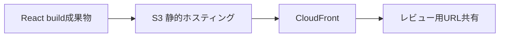
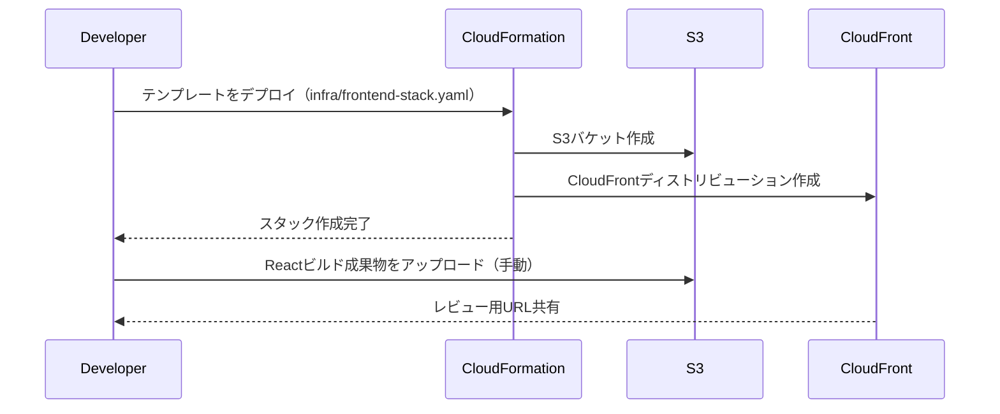
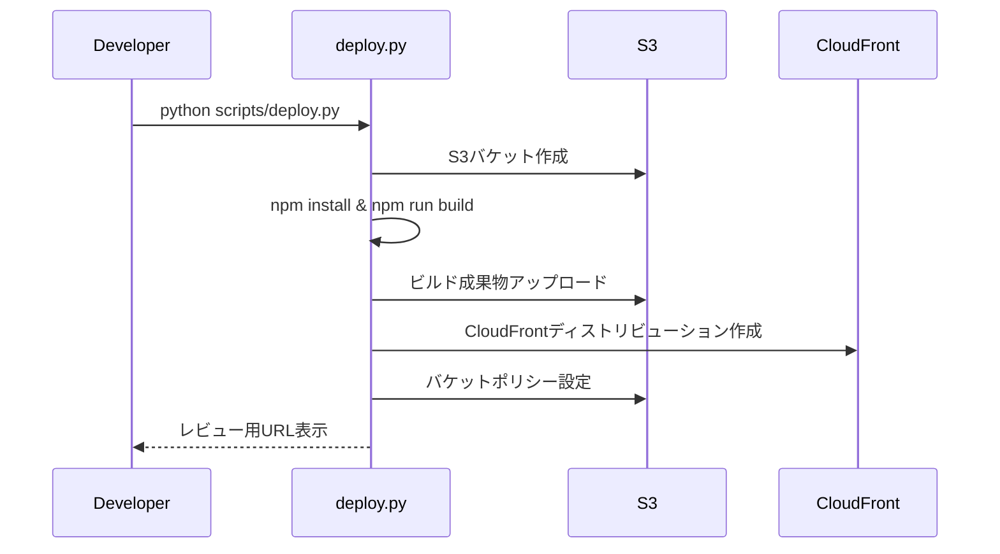

# frontend-preview-env 概要

新規開発（ゼロベース）フェーズで、フロントエンド（React）の画面を環境構築を待たずにレビュー可能にする"一時プレビュー環境"を標準化するための検証リポジトリです。

※ 本READMEでは「01開発」＝「新規開発（ゼロベース）」を指します。

## 課題（Before）
- 環境構築完了まで画面レビューができない
- レビューのタイミング・方法が属人化し、手戻りが発生
- 初期段階のUI/UX合意形成が遅れる

## 解決（目的）
- 画面レビューを前倒しして認識齟齬を削減
- ローカル依存を排し、再現性ある手順に標準化
- 使い捨ての一時環境で迅速に共有・破棄

## アーキテクチャ


```mermaid
flowchart LR
    A[React build成果物] --> B[S3 静的ホスティング]
    B --> C[CloudFront]
    C --> D[レビュー用URL共有]
```

---

## 2つのデプロイ方法

このリポジトリでは以下の2つの方法でプレビュー環境を構築できます。

| | CloudFormation | Python スクリプト |
|---|---|---|
| **対象者** | AWSコンソール操作に慣れている方 | Python/CLI操作に慣れている方 |
| **インフラ構築** | YAMLテンプレートをコンソールからデプロイ | `deploy.py` が自動作成 |
| **Reactビルド** | ローカルでビルド後、手動アップロード | スクリプトが自動ビルド＆アップロード |
| **管理** | CloudFormationでリソースを一元管理 | AWSコンソールで個別管理 |

### 方法1: CloudFormation（推奨）


```mermaid
sequenceDiagram
    participant Dev as Developer
    participant CF as CloudFormation
    participant S3 as S3
    participant CDN as CloudFront

    Dev->>CF: テンプレートをデプロイ（infra/frontend-stack.yaml）
    CF->>S3: S3バケット作成
    CF->>CDN: CloudFrontディストリビューション作成
    CF-->>Dev: スタック作成完了
    Dev->>S3: Reactビルド成果物をアップロード（手動）
    CDN-->>Dev: レビュー用URL共有
```

詳細手順 → [docs/how-to/cloudformation-guide.md](docs/how-to/cloudformation-guide.md)

### 方法2: Python スクリプト


```mermaid
sequenceDiagram
    participant Dev as Developer
    participant Script as deploy.py
    participant S3 as S3
    participant CDN as CloudFront

    Dev->>Script: python scripts/deploy.py
    Script->>S3: S3バケット作成
    Script->>Script: npm install & npm run build
    Script->>S3: ビルド成果物アップロード
    Script->>CDN: CloudFrontディストリビューション作成
    Script->>S3: バケットポリシー設定
    Script-->>Dev: レビュー用URL表示
```

詳細手順 → [docs/how-to/python-script-guide.md](docs/how-to/python-script-guide.md)

---

## ファイル構成

```
frontend-preview-env/
├── Dockerfile                      # Docker イメージ定義
├── docker-compose.yml              # Docker Compose 設定
├── requirements.txt                # Python 依存パッケージ
├── config.py                       # AWS認証情報・設定読み込み
├── README.md                       # このファイル
├── infra/
│   └── frontend-stack.yaml         # CloudFormation テンプレート
├── scripts/
│   └── deploy.py                   # Pythonデプロイスクリプト
├── app/                            # React アプリケーション
│   ├── package.json
│   ├── vite.config.js
│   ├── index.html
│   └── src/
│       ├── App.jsx
│       ├── App.css
│       ├── main.jsx
│       └── index.css
└── docs/
    ├── how-to/
    │   ├── cloudformation-guide.md # CloudFormation 手順書
    │   └── python-script-guide.md  # Python スクリプト手順書
    └── setup-guides/               # 開発環境セットアップガイド
        ├── Docker構築.md
        ├── GitHub Desktop.md
        ├── VS Code構築.md
        └── WSL環境構築.md
```

---

## 技術スタック
- **React** - UIフレームワーク
- **Vite** - フロントエンドビルドツール
- **Docker** - コンテナ化と環境統一
- **AWS S3** - 静的ホスティング
- **AWS CloudFront** - CDN配信
- **AWS CloudFormation** - インフラのコード化（IaC）

## 残件・今後の課題

| # | 内容 | 概要 |
|---|---|---|
| 1 | **CI/CD の実装** | GitHub Actions 等を使い、Reactのビルド〜S3アップロードを自動化する |
| 2 | **Terraform での構築** | CloudFormation の代わりに Terraform でインフラをコード化し、構築・削除を管理する |

---

## リポジトリの位置づけ
完成を目的としない検証用。チーム展開・改善議論のベースとする。
