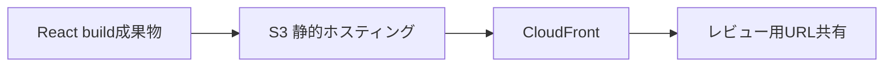
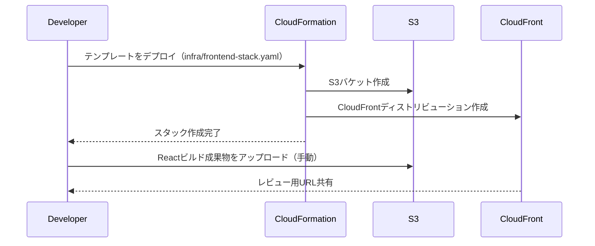
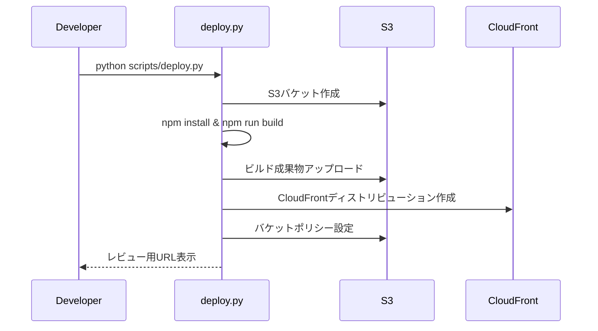
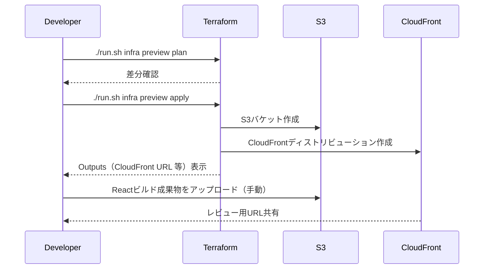

# frontend-preview-env 概要

新規開発（ゼロベース）フェーズで、フロントエンド（React）の画面を環境構築を待たずにレビュー可能にする"一時プレビュー環境"を標準化するための検証リポジトリです。

※ 本READMEでは「01開発」＝「新規開発（ゼロベース）」を指します。

## 課題（Before）
- 環境構築完了まで画面レビューができない
- レビューのタイミング・方法が属人化し、手戻りが発生
- 初期段階のUI/UX合意形成が遅れる

## 解決（目的）
- 画面レビューを前倒しして認識齟齬を削減
- ローカル依存を排し、再現性ある手順に標準化
- 使い捨ての一時環境で迅速に共有・破棄

## アーキテクチャ


```mermaid
flowchart LR
    A[React build成果物] --> B[S3 静的ホスティング]
    B --> C[CloudFront]
    C --> D[レビュー用URL共有]
```

---

## 3つのデプロイ方法

このリポジトリでは以下の3つの方法でプレビュー環境を構築できます。

| | CloudFormation | Python スクリプト | Terraform |
|---|---|---|---|
| **対象者** | AWSコンソール操作に慣れている方 | Python/CLI操作に慣れている方 | IaC/CLI 操作に慣れている方 |
| **インフラ構築** | YAMLテンプレートをコンソールからデプロイ | `deploy.py` が自動作成 | HCL で定義、`run.sh` でデプロイ |
| **Reactビルド** | ローカルでビルド後、手動アップロード | スクリプトが自動ビルド＆アップロード | ローカルでビルド後、手動アップロード |
| **管理** | CloudFormationでリソースを一元管理 | AWSコンソールで個別管理 | Terraform State で一元管理 |
| **CI/CD** | - | - | GitHub Actions で plan/apply 自動化 |

### 方法1: CloudFormation（推奨）


```mermaid
sequenceDiagram
    participant Dev as Developer
    participant CF as CloudFormation
    participant S3 as S3
    participant CDN as CloudFront

    Dev->>CF: テンプレートをデプロイ（infra/frontend-stack.yaml）
    CF->>S3: S3バケット作成
    CF->>CDN: CloudFrontディストリビューション作成
    CF-->>Dev: スタック作成完了
    Dev->>S3: Reactビルド成果物をアップロード（手動）
    CDN-->>Dev: レビュー用URL共有
```

詳細手順 → [docs/how-to/cloudformation-guide.md](docs/how-to/cloudformation-guide.md)

### 方法2: Python スクリプト


```mermaid
sequenceDiagram
    participant Dev as Developer
    participant Script as deploy.py
    participant S3 as S3
    participant CDN as CloudFront

    Dev->>Script: python scripts/deploy.py
    Script->>S3: S3バケット作成
    Script->>Script: npm install & npm run build
    Script->>S3: ビルド成果物アップロード
    Script->>CDN: CloudFrontディストリビューション作成
    Script->>S3: バケットポリシー設定
    Script-->>Dev: レビュー用URL表示
```

詳細手順 → [docs/how-to/python-script-guide.md](docs/how-to/python-script-guide.md)

### 方法3: Terraform


```mermaid
sequenceDiagram
    participant Dev as Developer
    participant TF as Terraform
    participant S3 as S3
    participant CDN as CloudFront

    Dev->>TF: ./run.sh infra preview plan
    TF-->>Dev: 差分確認
    Dev->>TF: ./run.sh infra preview apply
    TF->>S3: S3バケット作成
    TF->>CDN: CloudFrontディストリビューション作成
    TF-->>Dev: Outputs（CloudFront URL 等）表示
    Dev->>S3: Reactビルド成果物をアップロード（手動）
    CDN-->>Dev: レビュー用URL共有
```

詳細手順 → [docs/how-to/terraform-guide.md](docs/how-to/terraform-guide.md)

#### Terraform クイックスタート

```bash
# 1. バックエンド用リソースを事前作成（初回のみ）
aws s3api create-bucket --bucket your-tfstate-bucket --region ap-northeast-1 \
  --create-bucket-configuration LocationConstraint=ap-northeast-1
aws dynamodb create-table --table-name terraform-state-lock \
  --attribute-definitions AttributeName=LockID,AttributeType=S \
  --key-schema AttributeName=LockID,KeyType=HASH \
  --billing-mode PAY_PER_REQUEST --region ap-northeast-1

# 2. 設定ファイルを編集（バケット名などを実際の値に変更）
vi infra/envs/preview/backend.conf   # bucket, dynamodb_table を変更
vi infra/envs/preview/default.tfvars # s3_bucket_name を変更

# 3. 構文チェック → 差分確認 → 適用
./run.sh infra preview validate
./run.sh infra preview plan
./run.sh infra preview apply

# 4. React ビルドをアップロード
cd app && npm run build && cd ..
aws s3 sync app/dist/ s3://<s3_bucket_name>/frontend/ --delete
aws cloudfront create-invalidation --distribution-id <distribution_id> --paths "/*"

# 5. 削除
cd infra && terraform destroy -var-file="./envs/preview/default.tfvars"
```

#### run.sh アクション一覧

| アクション | 内容 |
|---|---|
| `plan` | 差分確認（変更は行わない） |
| `apply` | インタラクティブな適用（確認あり） |
| `apply-auto` | 自動適用（CI/CD 向け） |
| `fmt` | コードフォーマット |
| `fmt-check` | フォーマットチェックのみ |
| `validate` | 構文チェック |
| `lint` | TFLint による静的解析 |
| `security` | Trivy によるセキュリティスキャン |

---

## ファイル構成

```
frontend-preview-env/
├── Dockerfile                      # Docker イメージ定義
├── docker-compose.yml              # Docker Compose 設定
├── requirements.txt                # Python 依存パッケージ
├── config.py                       # AWS認証情報・設定読み込み
├── README.md                       # このファイル
├── run.sh                          # Terraform ラッパースクリプト
├── infra/
│   ├── frontend-stack.yaml         # CloudFormation テンプレート
│   ├── main.tf                     # Terraform Provider・バックエンド定義
│   ├── variables.tf                # Terraform 変数定義
│   ├── outputs.tf                  # Terraform 出力定義
│   ├── s3.tf                       # S3 バケット・バケットポリシー
│   ├── cloudfront.tf               # OAC + CloudFront ディストリビューション
│   ├── .tflint.hcl                 # TFLint 設定
│   └── envs/
│       └── preview/
│           ├── backend.conf        # State バックエンド設定
│           └── default.tfvars      # preview 環境の変数値
├── .github/
│   └── workflows/
│       ├── terraform-plan.yml      # PR 時に plan を実行して PR コメント
│       └── terraform-apply.yml     # main push 時に apply を自動実行
├── scripts/
│   └── deploy.py                   # Pythonデプロイスクリプト
├── app/                            # React アプリケーション
│   ├── package.json
│   ├── vite.config.js
│   ├── index.html
│   └── src/
│       ├── App.jsx
│       ├── App.css
│       ├── main.jsx
│       └── index.css
└── docs/
    ├── how-to/
    │   ├── cloudformation-guide.md # CloudFormation 手順書
    │   ├── python-script-guide.md  # Python スクリプト手順書
    │   └── terraform-guide.md      # Terraform 手順書
    └── setup-guides/               # 開発環境セットアップガイド
        ├── Docker構築.md
        ├── GitHub Desktop.md
        ├── VS Code構築.md
        └── WSL環境構築.md
```

---

## 技術スタック
- **React** - UIフレームワーク
- **Vite** - フロントエンドビルドツール
- **Docker** - コンテナ化と環境統一
- **AWS S3** - 静的ホスティング
- **AWS CloudFront** - CDN配信
- **AWS CloudFormation** - インフラのコード化（IaC）
- **Terraform** - インフラのコード化（IaC）、マルチ環境管理

## 残件・今後の課題

| # | 内容 | 概要 |
|---|---|---|
| 1 | **CI/CD の実装（React ビルド）** | GitHub Actions 等を使い、Reactのビルド〜S3アップロードを自動化する（Terraform の apply は `.github/workflows/` 実装済み） |
| 2 | **Terraform バックエンドの事前構築** | `infra/envs/preview/backend.conf` の S3 バケット・DynamoDB テーブルを実環境に合わせて作成・設定する |
| 3 | **GitHub Actions OIDC 設定** | AWS IAM に GitHub Actions 用 OIDC プロバイダーとロールを作成し、リポジトリの Secrets に `AWS_ROLE_ARN` を登録する |
| 4 | **root 所有ディレクトリの削除** | `sudo rm -rf infra_cloudformation/` で不要なディレクトリを削除する |

---

## リポジトリの位置づけ
完成を目的としない検証用。チーム展開・改善議論のベースとする。
