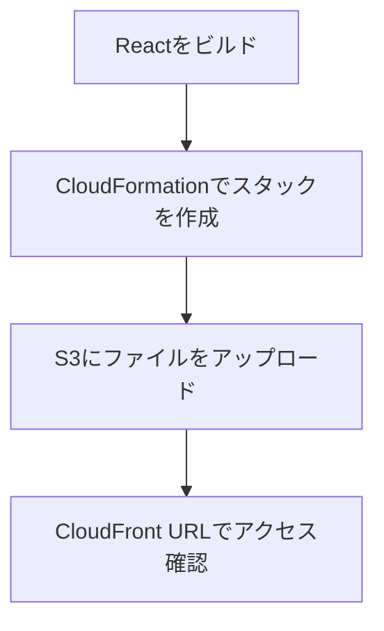
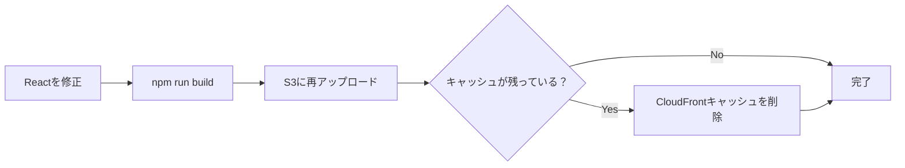
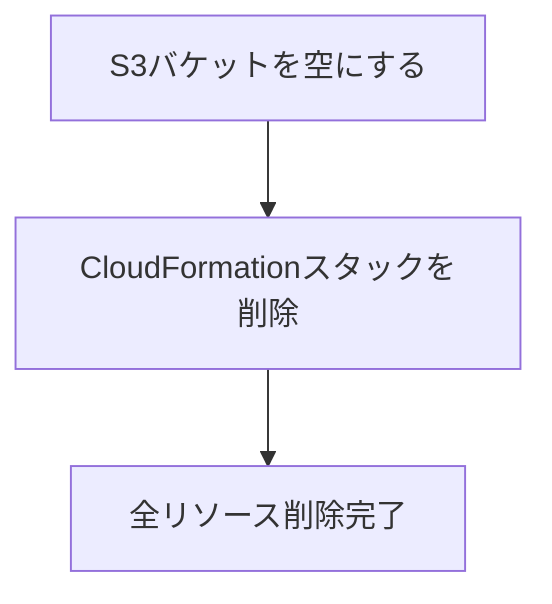

# CloudFormation を使ったプレビュー環境の手順書

`infra/frontend-stack.yaml` を使って AWSコンソールからプレビュー環境を構築・削除する手順です。

---

## 前提条件

- AWSアカウントへのアクセス権限（S3・CloudFront・CloudFormationの操作権限）
- Node.js / npm がインストールされていること（Reactビルド用）

---

## 環境構築（作成）

### 全体の流れ



---

### ステップ1: React アプリをビルドする

ローカル環境でビルド成果物（`app/dist/`）を生成します。

```bash
cd app
npm install
npm run build
```

`app/dist/` に以下のようなファイルが生成されます：

```
app/dist/
├── index.html
└── assets/
    ├── index-xxx.js
    └── index-xxx.css
```

---

### ステップ2: CloudFormation でスタックを作成する

1. AWSコンソール → **CloudFormation** → 「スタックの作成」→「新しいリソースを使用（標準）」

2. テンプレートの指定
   - 「テンプレートファイルのアップロード」を選択
   - `infra/frontend-stack.yaml` をアップロード

3. パラメータを入力

   | パラメータ名 | 説明 | 入力例 |
   |---|---|---|
   | `S3BucketName` | S3バケット名（小文字・数字・ハイフンのみ） | `41th-frontend-preview` |
   | `DistributionComment` | CloudFrontの説明（任意） | `Frontend Preview Distribution` |
   | `DefaultTTL` | キャッシュ有効期限（秒）| `86400`（1日） |

4. スタック名を入力（例：`test41-frontend-preview-env`）

5. 「スタックの作成」を実行

6. イベントタブで全リソースが `CREATE_COMPLETE` になるまで待機（数分）

---

### ステップ3: S3 にファイルをアップロードする

1. AWSコンソール → **S3** → 作成されたバケットを開く

2. 「フォルダを作成」→ フォルダ名 `frontend` で作成

3. `frontend/` フォルダを開き「アップロード」

4. `app/dist/` の**中身**（`index.html` と `assets/` フォルダ）を選択してアップロード

   > `dist/` フォルダ自体ではなく、中身だけをアップロードしてください

   アップロード後のS3構成：
   ```
   s3://バケット名/
   └── frontend/
       ├── index.html
       └── assets/
           ├── index-xxx.js
           └── index-xxx.css
   ```

---

### ステップ4: アクセス確認

1. AWSコンソール → **CloudFormation** → スタックを選択 → 「出力」タブ

2. `CloudFrontUrl` の値をコピーしてブラウザでアクセス

   例：`https://d123xyz.cloudfront.net`

> CloudFrontのデプロイ完了まで数分〜数十分かかる場合があります。

---

## コンテンツの更新（再デプロイ）

Reactを修正した場合は以下の手順で更新します。



1. `npm run build` で再ビルド
2. S3の `frontend/` フォルダに上書きアップロード
3. キャッシュが残っている場合はCloudFrontで無効化（Invalidation）を実行
   - AWSコンソール → CloudFront → ディストリビューション → 「無効化」タブ
   - オブジェクトパス: `/*`

---

## 環境削除

### 全体の流れ



> S3バケットにファイルが残っているとスタック削除が失敗します。必ず先にS3を空にしてください。

---

### ステップ1: S3バケットを空にする

1. AWSコンソール → **S3** → 対象バケットを選択

2. 「空にする」ボタンをクリック

3. 確認入力欄に `permanently delete` と入力して実行

---

### ステップ2: CloudFormation スタックを削除する

1. AWSコンソール → **CloudFormation** → 対象スタックを選択

2. 「スタックを削除」をクリック

3. イベントタブでスタックが `DELETE_COMPLETE` になるまで待機

以下のリソースがすべて削除されます：
- S3バケット
- CloudFrontディストリビューション
- Origin Access Control
- S3バケットポリシー
