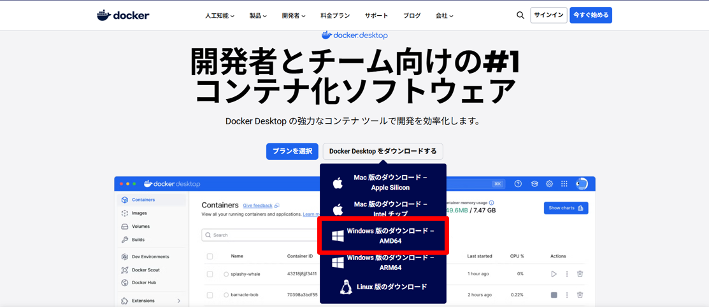
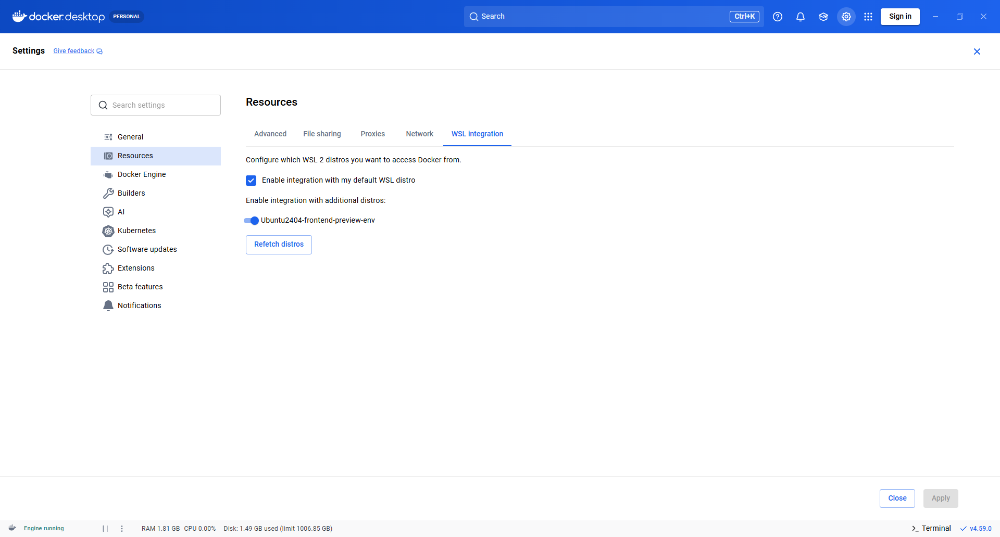
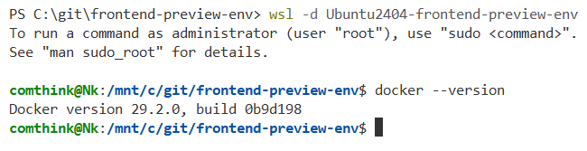

## 1．Docker Desktopのインストール

<https://www.docker.com/ja-jp/products/docker-desktop/>

上記サイトでAMD64版をインストールします



ダウンロードしたインストーラを立ち上げ、デフォルトのチェックのままOKを押下しインストール


インストール完了


アカウントはスキップボタンで作成をスキップ


2．WSL Integrationの設定

ヘッダーの歯車→Resources→WSL Integrationタブに移動→\
Ubuntu2404-frontend-preview-envのトグルをONにする→画面右下「Apply＆Restart」を押下しDockerを再起動



## 3．インストールと設定の確認

Powershellを開く

下記コマンドを入力してUbuntuを起動

```null
wsl -d Ubuntu2404-frontend-preview-env
```


docker --versionでUbuntuにDockerがインストールされていることを確認

```null
docker --version
```




バージョンが表示されればDockerの準備は完了