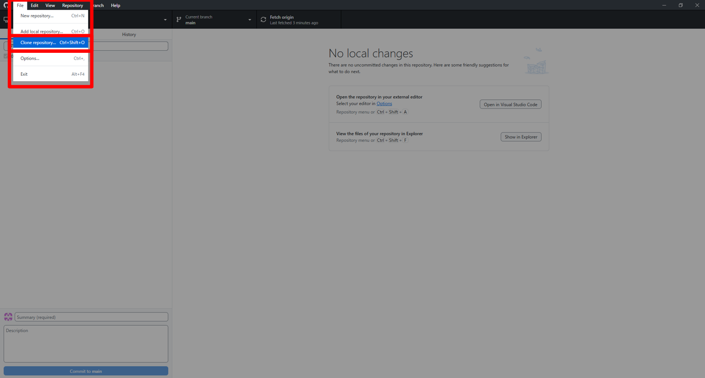
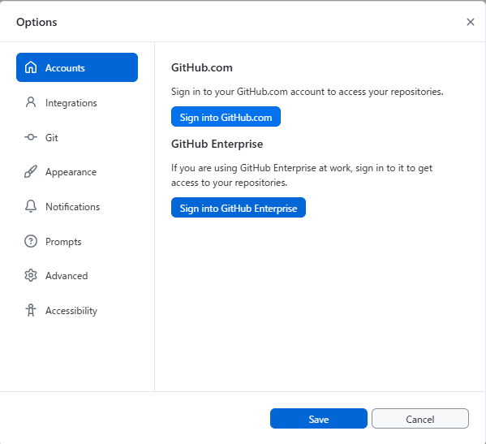

## **前提**

* Github Desktopがインストールされている
* GitHubアカウントがある
* `frontend-preview-env`へのアクセス権がある

※なければリポジトリ管理者にアクセス権付与を依頼してください


## 1.GitHub DesktopにGitHubアカウントでログインする

GitHub Desktopを開き、画面左上の「File」タブからOptionsを押下します





「Accounts」に自分のアカウントが表示されていればログインできています。


下の画面であれば「Sign into [GitHub.com](http://GitHub.com)」を押下してログイン操作を行ってください



## 2.GitHub Desktopでリポジトリのクローンを作成する

Fileタブから、Clone Repositoryを選択します


「GitHub.com」タブから「NIHON-COMTHINK/frontend-preview-env」を選択し、「Local Path」の欄は下記のパスをコピーして書き換え、「Clone」ボタンを押下します

※パス中の「comthink」は「WSL環境構築」で設定したユーザー名です\
※必要があれば先に～\\git\\dk-ssecフォルダまで作成してください

```auto
\\wsl.localhost\Ubuntu2404-dk-ssec\home\comthink\git\dk-ssec
```


クローンが開始します

下記画像のメッセージが出たら、「Trust Repository」を押します


画面左上の「Current repository」が「frontend-preview-env」になっていれば完了です


## トラブルシューティング

### 「Permission denied」でGit操作ができなくなった/Github Desktopで行った操作が反映されない

再起動などの操作で、Windows上のアプリからWSL上のファイルへのアクセスができなくなることがあります。\
その場合、所有者を「comthink」（WSL環境構築で作成したユーザー）に変更することでアクセスできるようになります。

**1. Powershellを開く**

**2. WSLのUbuntuを起動**

下記コマンドを入力してUbuntuを起動します

```auto
wsl -d Ubuntu2404-dk-ssec
```


**3. .gitがあるディレクトリに移動**

```auto
cd  /home/comthink
```


**4. .git配下のファイル/ディレクトリの所有者を「comthink」に変更する**

下記コマンドを入力し、パスワードを入力します。パスワードは`comthink`です

```auto
sudo chown -R comthink:comthink git
```


下記確認用コマンドで、.gitの所有者がcomthinkになっていればWindowsからgit操作が可能です。

```auto
ls -l
```


