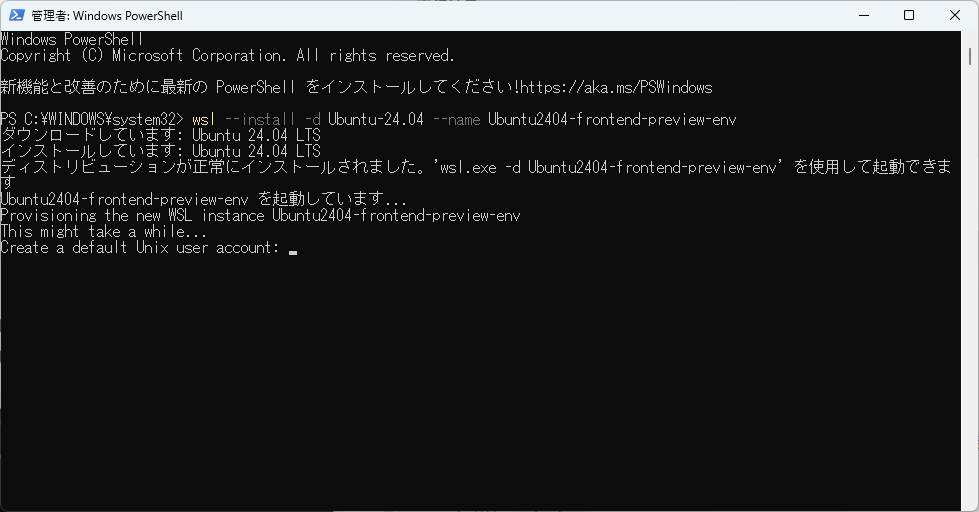
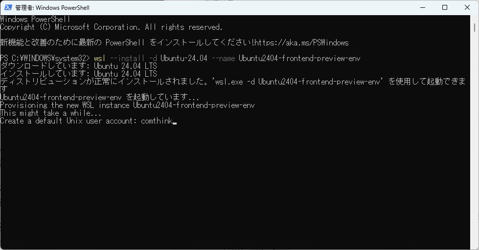

## 1. Powershellを開く
1. WSLのバージョンを確認する

下記コマンドを実行し、プログラムの情報を取得します

```auto
Get-AppxPackage -Name "*WindowsSubsystemForLinux*"
```


「Version」が2.4以下、もしくは実行結果が出力されない場合、下記コマンドを入力して最新のWSLをインストールします

```auto
winget install --id Microsoft.WSL
```

再度下記コマンドを実行して、バージョンが2.5以上になっているか確認してください

```auto
Get-AppxPackage -Name "*WindowsSubsystemForLinux*"
```

## 3. WSLをインストールするコマンドを入力

Ubuntuを指定してインストールします

```null
wsl --install -d Ubuntu-24.04 --name Ubuntu2404-frontend-preview-env
```




## 4. Ubuntuのユーザーを作成

上記コマンドを入力するとUbuntuがインストールされ、ユーザー名とパスワードを求められるので、下記の通り入力してください。パスワードは確認のため再入力を求められるので、再度入力します。\
ユーザー作成に成功すると、下画像のようにUbuntuのターミナルに切り替わります。

※パスワードは入力しても表示されませんが、入力されているのでそのままエンターを押してください。

* ユーザー名：comthink
* パスワード：comthink



## トラブルシューティング

### ■WSLがバージョンアップされて、system.vhdがいなくなったというエラーメッセージが表示される場合

### 【対応方法】

WSLがバージョンアップされて、上記のエラーメッセージが表示される場合、下記のコマンドを実行して対応する。

#### １.WSLを停止する。

```auto
wsl --shutdown
```

#### 2.WSLをアンインストールする。

```auto
wsl --uninstall
```

#### 3.WSLをインストールする。

```auto
winget install --id Microsoft.WSL
```

#### 4.PCを再起動する。

再起動後、既存のディストリビューションが再び利用可能になるはずです。

※下記のコマンド「wsl -l -v」を実行して、statsがrunningになっていることを確認する。